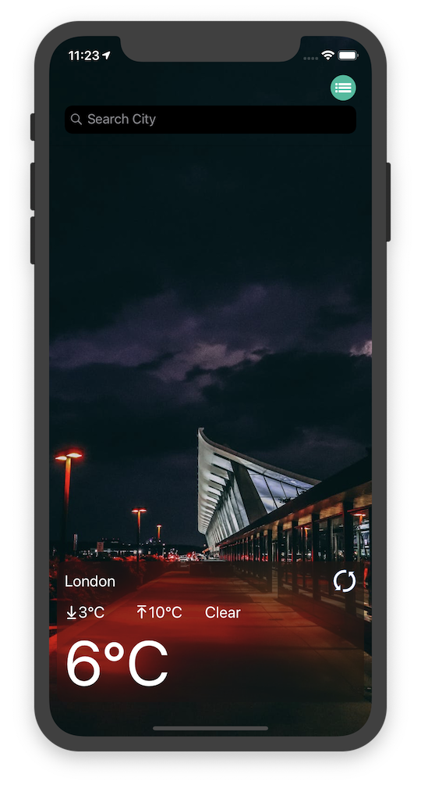
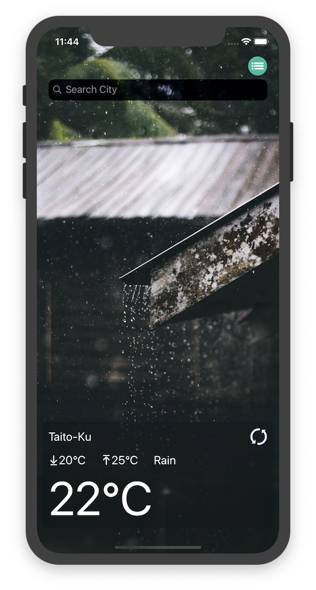

# IDNow_WeatherApp
This application was created to show the city weather by using API from OpenWeatherMap.
- The application start with the main view showing the current location weather information.
- The current weather information will be saved locally, and reload later when the app relaunch
- The main view background will show according to the current weather condifion (clear, rain, storms, clouds, fog, drizzle, snow)
- A refresh button to retrieve the latest weather information
- A search bar on top for search other city weather
- A pop up weather info view will show for search result
	- A "Add" button to add the city and weather into core data
	- A "Close" button to dismiss the view
- A top right button to show the saved city weather list
	- saved city weather can be delete indiviually
	- A "Detete All" button at the top right for remove all city weather at once 

### Architecture:
- The MVC architecture was chosen for developing this applicaton as requirement.
- The application did not use any xib for structuring the view, all UI components are handled by UIAutolayout and NSConstraints, which gives more control, help maintain resusability, and avoid merge conflict, etc.

### 3rd-party dependencies:
- iOSSnapshotTestCase (FBSnapshotTestCase) for UI snapshot tests
- Alamofire 5.0

## Specs
- Swift version: 5
- Xcode version: 10.3

## Screenshots

